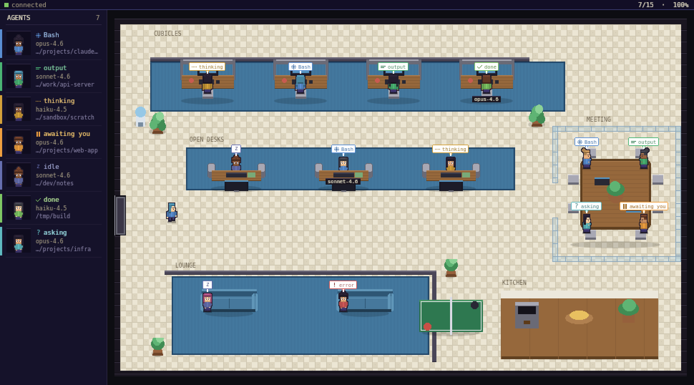
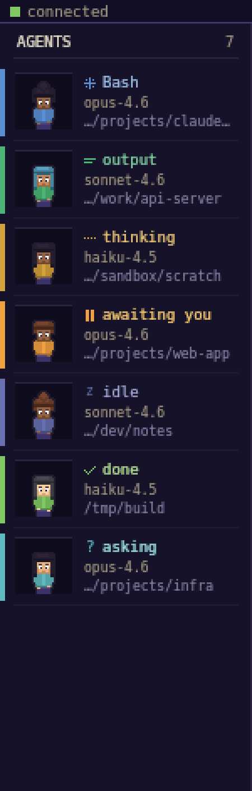

# Claude HQ

A pixel-art virtual office that visualizes your live **Claude Code** sessions. Every agent walks
into a tiny top-down office, takes a seat, and animates what it's doing right now — thinking,
running a tool, typing output, waiting on you — so you can see the state of all your agents at a
glance.

<p align="center">
  
</p>

## What it does

Claude HQ runs a small menu-bar daemon. As your Claude Code sessions do work, they emit activity
events; the daemon feeds a pixel office where each session is a little character:

- **Live status, at a glance.** Each agent's shirt is tinted by state and a chip above their head
  shows an icon + label — `thinking`, `tool` (with the tool name, e.g. `Bash`), `output`, `done`,
  `error`, `awaiting you`, `asking`, `compacting`. Blocked agents (permission / asking) pulse so
  you can spot them fast.
- **An agent roster.** A sidebar lists every active agent with an animated portrait, its status,
  the model in use, and the **working directory** it's running in — so you always know who's where.
- **A real office.** A glass-walled meeting room, cubicles, open-desk pods, a lounge, and a
  kitchen. Sub-agents (from `Task`) get their own characters.
- **Distinct people.** Characters are composed from layered sprites (skin tone, hairstyle,
  glasses/headphones) keyed off the session id, so each agent looks like its own person.

<p align="center">
  
  &nbsp;&nbsp;&nbsp;
  
</p>

## How it works

```
Claude Code  ──hook──▶  ~/.claude-hq/hooks/claude_hq_hook.py
                                 │  POST /event  (127.0.0.1:7823–7833)
                                 ▼
                         claude-hq daemon  ──WebSocket──▶  renderer (pixel office)
```

The daemon (a [Tauri](https://tauri.app) app) exposes a tiny HTTP endpoint and a WebSocket. Any
producer that can `POST /event` shows up in the office — by default that's a Claude Code **hook**,
but a passive transcript tailer and a legacy PTY shim are also included.

## Requirements

- **macOS** (menu-bar tray + always-on-top window are tuned for macOS; Linux likely works too)
- **Rust** toolchain — install from <https://rustup.rs>
- **python3** — used by the hook bridge / tailer (preinstalled on macOS)
- **Claude Code** (the `claude` CLI)

## Install

```bash
git clone git@github.com:desmondchoon/claude-hq.git
cd claude-hq
./install.sh           # release build; add --debug for a faster, unoptimized build
```

`install.sh` builds the binaries into `~/.claude-hq/bin`, then installs the **Claude Code hooks**
(the default integration). This writes a small hook into `~/.claude/settings.json` (your existing
hooks are preserved and backed up) and a helper script under `~/.claude-hq/hooks/`. **No PATH
change or shell reload is needed.**

Then:

```bash
~/.claude-hq/bin/claude-hq      # start the daemon (menu bar + window)
```

Now run Claude Code as you normally would — from a terminal or an editor that uses it — and the
session appears in the office automatically.

> **Development:** use `./start.sh` instead. It does an incremental build, (re)installs the hooks,
> and runs the daemon in the foreground (Ctrl-C to quit). Open `src/preview.html` in a browser to
> see the renderer animate with synthetic agents — no daemon or Claude Code required.

## Status legend

| Chip | Meaning |
|------|---------|
| `… thinking` | model is reasoning |
| `⚙ <tool>` | running a tool (shows the name, e.g. `Bash`, `Read`) |
| `≡ output` | streaming a response |
| `✓ done` | finished (walks out shortly after) |
| `! error` | the session errored |
| `‖ awaiting you` | blocked on a permission prompt — needs your input |
| `? asking` | asked a question and is waiting |
| `z idle` | no recent activity |

Zones map to arrangement: cubicle workers face their wall monitors, open-desk workers face out
(you see their faces), the meeting room seats people around a glass-walled table, and the lounge
is for idling.

## Ingestion options

By default, sessions are captured via **Claude Code hooks** — accurate, real-time, and works no
matter how `claude` is launched. Two alternatives are bundled:

- **Transcript tailer** (passive, zero-config): watches `~/.claude/projects/**/*.jsonl` and reports
  activity for every session, including model and working directory.
  ```bash
  python3 tools/transcript_tailer.py
  ```
- **Legacy PTY shim**: wraps the `claude` binary to scrape terminal output. Opt in with:
  ```bash
  ~/.claude-hq/bin/claude-hq install-shim   # then add ~/.claude-hq/bin to PATH
  ```

> Pick **one** primary source. The hook installer removes any old shim so a session isn't counted
> twice. Hooks + the tailer share the same session id, so running both is just redundant (harmless).

## Project layout

```
claude-hq/
├── src/                      Front-end (loaded by the Tauri webview)
│   ├── index.html
│   ├── renderer.js           Office + roster rendering, agent state machine
│   ├── sprites.js            Asset loader, layered character compositing, tinting
│   ├── socket.js             WebSocket client
│   ├── preview.html          Standalone browser demo (synthetic agents)
│   └── assets/               Generated pixel art (characters + office tiles)
├── src-tauri/                Rust daemon
│   ├── src/main.rs           App, tray, install subcommands
│   ├── src/ws.rs             HTTP /event + WebSocket broadcast
│   ├── src/parser.rs         Activity event model
│   ├── src/install.rs        Hooks installer (default) + legacy shim installer
│   └── src/bin/shim.rs       Legacy PTY shim
├── hooks/                    Hook bridge (claude_hq_hook.py) + installer + settings snippet
├── tools/                    Asset generators (Python) + transcript tailer
├── install.sh / start.sh / uninstall.sh
└── docs/                     README screenshots
```

## Regenerating the art

All pixel art is generated by scripts (requires `python3` + Pillow: `pip install pillow`). Edit a
palette or layout and re-run:

```bash
python3 tools/gen_chars.py    # character layers (skin/hair/shirt/outline/accessory) + atlas
python3 tools/gen_office.py   # floor/wall tiles + furniture sprites + atlas
python3 tools/gen_icon.py     # app icon (.png/.icns/.ico) + menu-bar tray glyph
python3 tools/gen_scene.py    # a static office preview (tools/_preview/)
```

## Uninstall

```bash
./uninstall.sh        # removes the hooks from settings.json and deletes ~/.claude-hq
```

## License

MIT — see `LICENSE` if present, otherwise do as you like.
